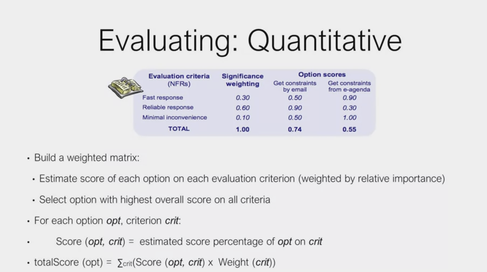

# Evaluating Alternatives

* Alternatives could change responsibilities
  * email vs text notifications
  * evaluation criteria needs to be agreed to by stakeholders for resolving conflict
* contribution non functional requirements 
  * security
  * scalability
  * usability 
*  weighted matrix
*  zero to 1 scale
*  everything should add up to matrix

* fast response
* minimal inconvenience 
* reliable response

