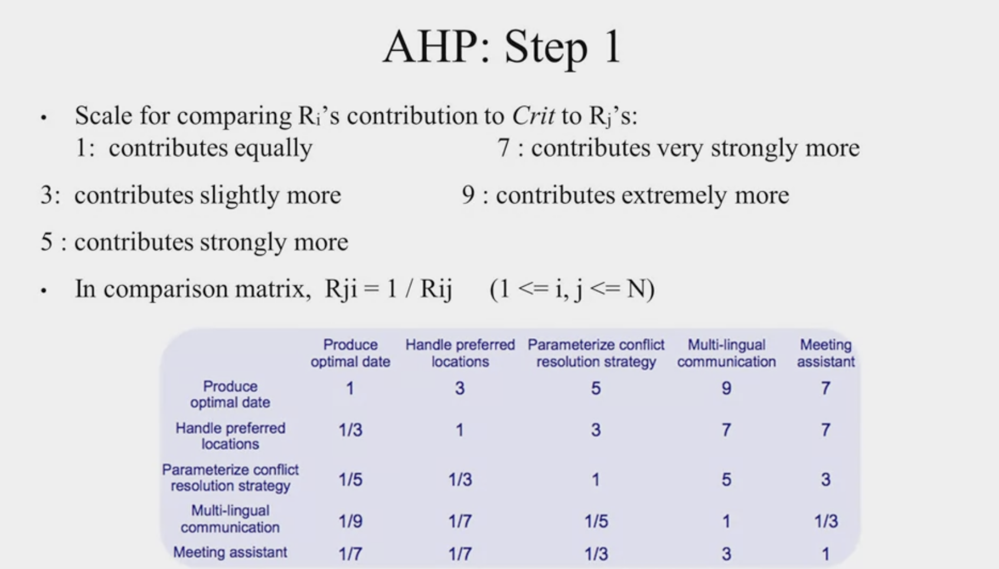

# Quantitative Risk Prioritization

* Order by equal prioritization 
contributions of requirements
value/cost trade off

* Analytic Hierarchical Process (AHP)
  * 1st value y axis
  * 2nd cost x axis

* Build Matrix

    

* Careful with scale because AHP is difficult with lots of requirements, cannot do this with every requirement 
  * Small groups of stakeholders to discuss
  * subset of requirements 

  Can learn more at [wiki requirements prioritization](https://en.wikipedia.org/wiki/Requirement_prioritization)
