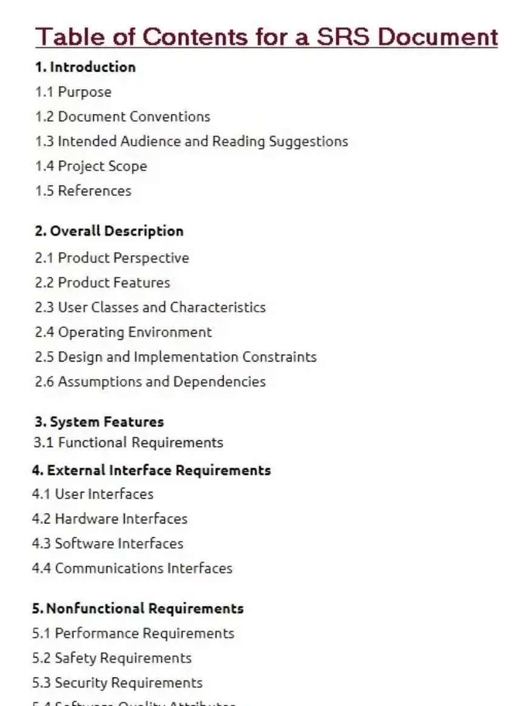

# Risk Acceptance, Assessment, and Prioritization Conclusions

* risk comes from language issues and conflicts
* lack of performing risk analysis and negotiation
* risks occur because of things we don't know
* haven't considered all the alternatives
* techniques of risk identification, risk and consequence analysis, prioritization of requirements, risks and alternatives
* should be used when writing full software requirements specification document

* risk comes from language issues and conflicts
* lack of performing risk analysis and negotiation
* risks occur because of things we don't know
* haven't considered all the alternatives
* techniques of risk identification, risk and consequence analysis, prioritization of requirements, risks and alternatives
* should be used when writing full software requirements specification document

