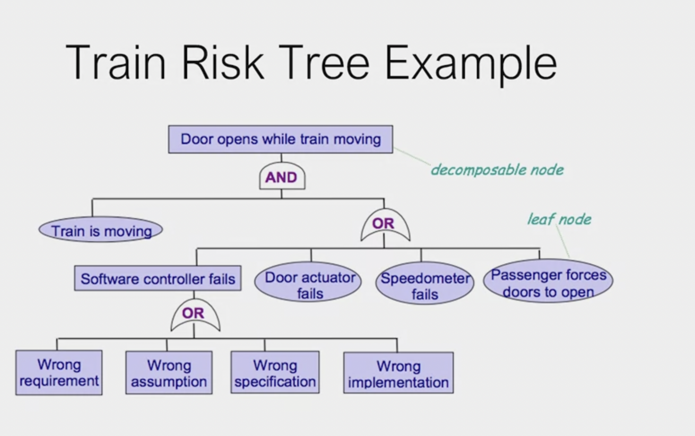

# Risk and Cut-Set Trees

* tree org for casual linking of consequences, failures, and causes

* failure or logical nodes

    * logical

    * and/or

    

wrong requirement, wrong specification, wrong implementation

[!IMPORTANT]

>Failure node:
>risk checklist example: NIST
>Guide words: patterns of failure example: "no", "more", "less", "after"
>combinations of these patterns leads to ambigious patterns

